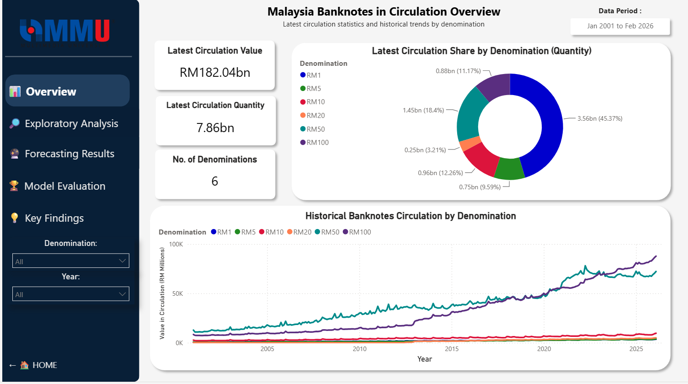
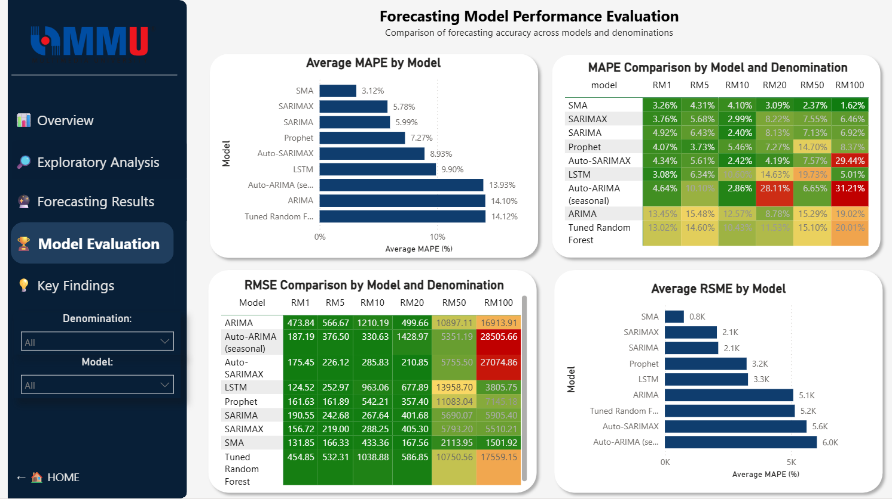
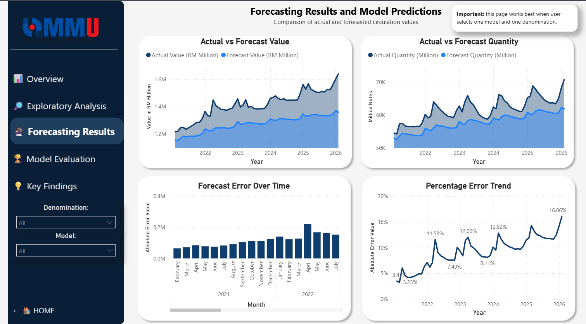
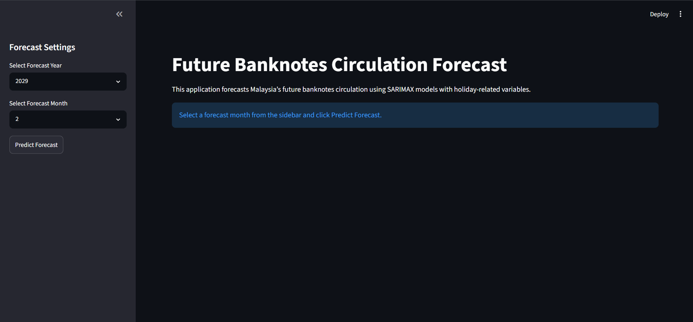
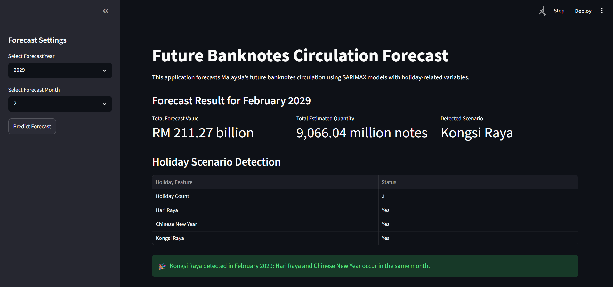
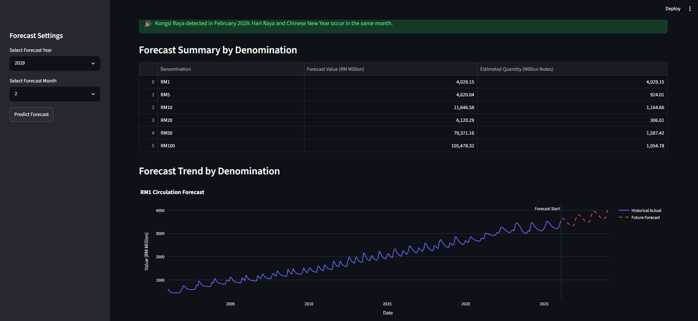
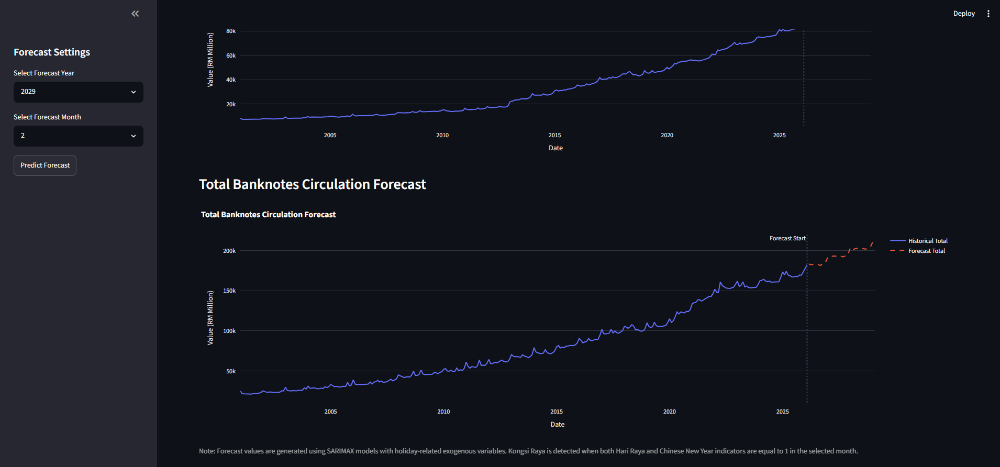

# Forecasting Malaysia's Banknotes in Circulation Using Econometric and Machine Learning Models

---

## 📖 Overview

This repository contains my Final Year Project (FYP) completed as part of the **Bachelor of Computer Science (Hons.) in Data Science** at **Multimedia University (MMU)**.

The project focuses on forecasting **Malaysia's banknotes in circulation** using both **econometric** and **machine learning** forecasting models. The objective is to compare different forecasting techniques and identify suitable models for assisting future cash planning and currency management.

Monthly data from **January 2000 to February 2026** published by **Bank Negara Malaysia (BNM)** was used in this study.

---

# 📌 Project Objectives

* Develop forecasting models for Malaysia's banknotes in circulation.
* Compare econometric and machine learning forecasting techniques.
* Evaluate forecasting performance using MAPE and RMSE.
* Analyse seasonal and festive effects on currency circulation.
* Develop interactive Power BI and Streamlit applications for visualization and future forecasting.

---

# 🏦 Banknote Denominations

The study covers six active Malaysian banknote denominations:

* RM1
* RM5
* RM10
* RM20
* RM50
* RM100

---

# 🧠 Forecasting Models

The following forecasting models were implemented and compared.

| Category         | Models                                           |
| ---------------- | ------------------------------------------------ |
| Baseline         | Simple Moving Average (SMA)                      |
| Econometric      | ARIMA, SARIMA, Auto-ARIMA, SARIMAX, Auto-SARIMAX |
| Machine Learning | Random Forest                                    |
| Hybrid / AI      | Prophet, Long Short-Term Memory (LSTM)           |

---

# ⚙️ Feature Engineering

Several temporal and holiday-related variables were engineered to improve forecasting performance.

* Lag Features
* Rolling Mean Features
* Month
* Quarter
* Year
* Cyclical Month (Sin/Cos)
* Holiday Count
* Hari Raya Indicator
* Chinese New Year Indicator
* Deepavali Indicator
* Pre-Holiday Count
* Post-Holiday Count

---

# 📊 Model Evaluation

Forecasting models were evaluated using:

* Mean Absolute Percentage Error (MAPE)
* Root Mean Squared Error (RMSE)

These metrics were calculated separately for each banknote denomination.

---

# 📈 Power BI Dashboard

An interactive Power BI dashboard was developed to visualize forecasting performance and banknotes circulation.

The dashboard includes:

* Executive Overview
* Historical Trend Analysis
* Denomination Analysis
* Seasonal Analysis
* Model Comparison
* Forecast Performance
* Monthly Error Distribution
* Key Findings

### Dashboard Overview

<p align="center">

</p>

---

### Model Comparison

<p align="center">

</p>

---

### Forecast Evaluation

<p align="center">

</p>

---

# 🌐 Streamlit Future Forecast Application

Besides Power BI, a Streamlit web application was developed to demonstrate real-time future forecasting.

The application:

* Loads trained SARIMAX models
* Forecasts future banknotes circulation
* Detects festive scenarios automatically
* Supports future forecasting up to multiple years ahead
* Displays historical and forecast trends
* Calculates estimated quantity of notes

---

### Streamlit Home

<p align="center">

</p>

---

### Future Forecast & Holiday Scenario Detection

The application automatically identifies whether the selected month contains:

* Hari Raya
* Chinese New Year
* Kongsi Raya
  
<p align="center">

</p>

<p align="center">

</p>

<p align="center">

</p>
---

# 💡 Key Findings

The study demonstrates several important findings.

* Simple Moving Average (SMA) achieved the lowest forecasting error for several denominations and serves as a strong baseline model.
* SARIMA and SARIMAX produced the most stable forecasting performance across different denominations.
* Holiday-related variables improved forecasting performance during festive periods.
* No single forecasting model consistently outperformed all others across every denomination.
* Streamlit enables interactive future forecasting by incorporating holiday-related exogenous variables.

---

Run the Streamlit.

```bash
streamlit run app.py
```

---

# 🛠 Technologies Used

* Python
* Google Colab
* Pandas
* NumPy
* Statsmodels
* Scikit-learn
* Prophet
* TensorFlow / Keras
* Power BI
* Streamlit
* Plotly

---

# 👨‍💻 Author

**Aidil Luqman Bin Mat Ropi**

Bachelor of Computer Science (Hons.) Data Science

Faculty of Computing and Informatics

Multimedia University (MMU)

---

# ⭐ Acknowledgement

If you found this repository useful or interesting, feel free to give it a ⭐ on GitHub.
